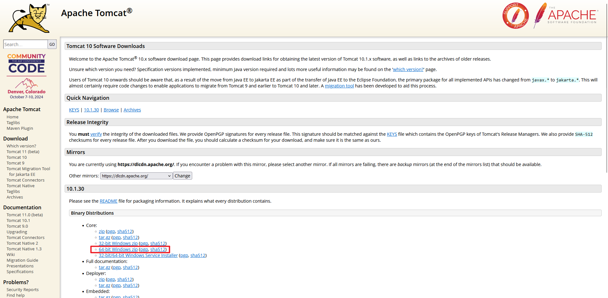
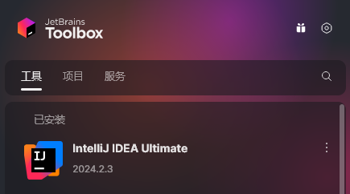
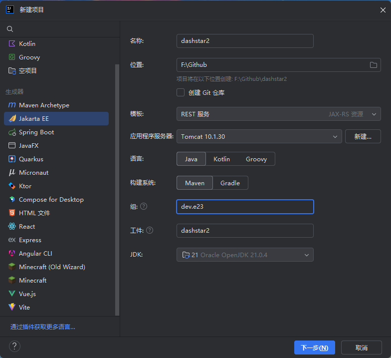
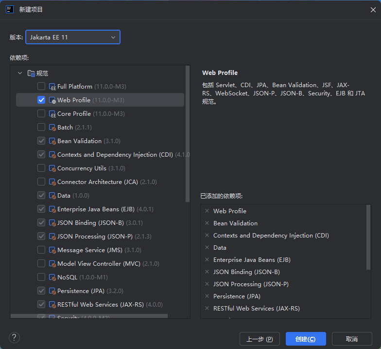
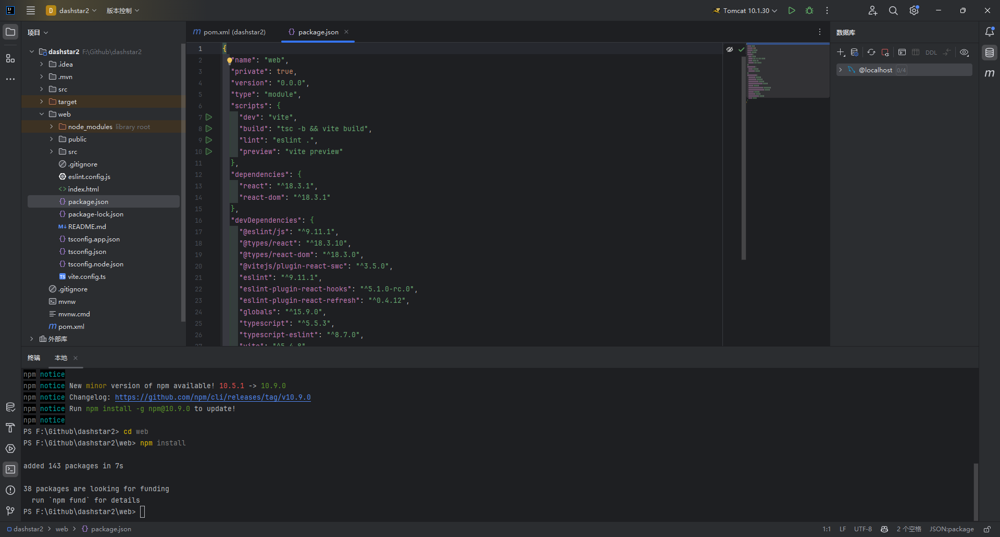
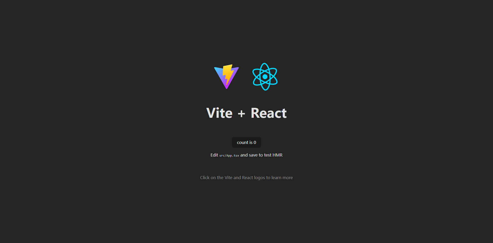

# Java 高级编程（JavaEE 程序设计与应用开发）期末作业教程

本教程及相关代码由 [@ElaBosak233](https://github.com/elabosak233) 撰写于 2024 学年第一学期，用于给 23 届学生在完成 Java 高级编程期末作业时提供指导。

## 前言

总的来说，我们需要使用本学期学习过的内容（或者尚未学习的内容），完成一个简易的 Blog（博客）后端。学有余力的同学，可以上手现代化前端开发，实现一个更加美观的博客系统。

### 考核

因为本学期学习的是 JavaEE，内容更加偏向后端开发，所以对于前端不做要求。只要完成后端部分，则可获得绝大部分分数，剩下的前端作为加分项。

### 目标

- 能够区分前端和后端
- 能够上手 JakartaEE 技术栈
- 能够使用 Maven 进行包管理、项目构建
- 能够配置 Tomcat 和 IDEA 开发环境
- 能够配置 Hibernate 和 MySQL 连接
- 能够设计项目中需要的实体类
- 能够区分 Controller、Service、Repository（DAO）层
- 能够使用 JWT 进行鉴权与 Token 分发

### 提问的智慧

在开发的过程中，难免会遇到各种各样的问题，如果你遇到了问题，那么首先应该尝试自己解决，因为只有自己解决了问题，你才会真正掌握它。但是，如果你尝试了各种方法都无法解决问题，那么你可以选择向他人寻求帮助。所以在开始之前，我强烈建议你先阅读 [提问的智慧](https://github.com/ryanhanwu/How-To-Ask-Questions-The-Smart-Way/blob/main/README-zh_CN.md) 这篇文章，这会帮助你更好地提问，从而获得你需要的帮助。因为说到底，我也只是一个学生，我没有义务帮你解决所有的问题，如果你能按照提问的智慧来提问，那么我可能会愿意帮你解决你的问题。

## 环境

环境配置是本教程的第一步，也是最重要的步骤。即使你的电脑上可能有 JDK 和 Tomcat，但他们可能不是本项目要求的版本，所以请不要偷懒，按照教程一步一步来，做好环境的配置与检查。

#### 有关网络的说明

由于国内网络问题，本教程中涉及到的某些链接可能无法直接访问，你需要加速器或者科学上网工具（或者说魔法）来访问这些链接，说实在的，没有魔法是真的寸步难行。

但我至少知道，[Watt Toolkit](https://steampp.net/) 可以帮你解决发生在 GitHub 上的大部分网络问题，但如果你需要访问其他网站（Google 或者什么其他的），那么你可能需要自己想办法了，这些内容不能明说。


### Java Development Kit 21

使用 Oracle JDK 21 作为 Java 开发环境，你可以从 [Oracle 官方网站](https://www.oracle.com/java/technologies/downloads/#java21) 下载并安装。


你可以选择下载安装版，也可以选择压缩包版，安装版会自动配置环境变量，而压缩包版需要手动配置。但实际上在使用 IDEA 的情况下，IDEA 内部可以选择使用某个路径下的特定 JDK，所以这里推荐下载压缩包版。

### Apache Tomcat 10

使用 Apache Tomcat 10 作为 Web 服务器，你可以从 [Tomcat 官方网站](https://tomcat.apache.org/download-10.cgi) 下载。



这里下载压缩包即可，无需安装版本的 Tomcat，因为我们的项目使用 IDEA + Maven 构建，所以 Tomcat 的配置将由 IDEA + Maven 完成。

### IntelliJ IDEA Ultimate

我们需要使用最新版（到截稿日的 IDEA 版本为 `2024.2.3`）的 IDEA 作为集成开发环境，你可以从 [IDEA 官方网站](https://www.jetbrains.com/idea/download/) 下载。当然，你也可以使用 JetBrains Toolbox 进行下载，同理 Toolbox 可以从 [Toolbox 官方网站](https://www.jetbrains.com/toolbox-app/) 下载。我比较推荐使用 Toolbox，因为 Toolbox 会自动下载并安装最新版的 IDEA，并且 Toolbox 还可以管理多个 Jetbrains 家的 IDE，非常方便（起码对我而言）。



另外说一句，JetBrains 的所有产品都可以使用 [JetBrains Student](https://www.jetbrains.com/student/) 计划免费申请学生许可证，只要使用学信网的在线验证报告即可，强烈建议申请一下正版 IDEA，不然这几天就先用着 30 天的试用版吧。

### MySQL

使用 MySQL 作为数据库，我们换一种方法，不从 MySQL 官方网站下载，而是使用 phpStudy 简化整个过程，你可以从 [phpStudy 官方网站](https://www.xp.cn/php-study) 下载 phpStudy。


打开后，点击 MySQL，然后点击启动，等待 MySQL 启动完成，此时你的 MySQL 已经在 3306 端口上启动了，MySQL 的用户名和密码都是 `root`。

### Maven

IDEA 自带 Maven，所以无需额外安装，但需要配置一下 Maven 的仓库地址，这里推荐使用阿里云的 Maven 仓库镜像。

### Node.js

大多数人可能是第一次见到 Node.js，我们需要 Node.js 来进行现代化前端开发，你可以从 [Node.js 官方网站](https://nodejs.org/en/) 下载并安装。

顺便使用终端（PowerShell）配置一下 npm 仓库地址，使用淘宝的 npm 镜像。

```bash
npm config set registry https://registry.npmmirror.com
```
### Git（可选）

使用 Git 作为版本控制工具，你可以从 [Git 官方网站](https://git-scm.com/downloads/win) 下载并安装。


#### GitHub Desktop

使用 GitHub Desktop 作为 GitHub 的图形化客户端（会方便很多），你可以从 [GitHub Desktop 官方网站](https://desktop.github.com/) 下载并安装。

## 立项

任何一个项目都需要一个名字，虽然本仓库的名字是 `dashstar`，但这个起名相当随意，各位可以起一个自己喜欢的名字。但有几点需要注意：

- 项目名称不能包含中文以及任何全角字符
- 只能包含英文字母、数字和下划线，不能包含空格

看到这里，那说明你已经决定了你的项目名字，作为演示，我把我的新项目起名为 `dashstar2`。

### 后端

现在我们打开 IDEA，新建项目，左侧选择 `Jakarta EE`，然后按照图中的指示进行配置。



有几个需要关注的点：

- 模板选择 REST 服务（JAX-RS 资源）
- 语言选择 Java
- 构建系统选择 Maven
- 组填写 `com.example` 或者其他什么类似的（比如 `com.baidu`），但是有一个建议，就是组名最好不要使用其他人的组名，举个很简单的例子，如果你使用 `com.baidu` 作为组名，那么你可能会和百度产生冲突，所以这里推荐使用 `com.example` 作为组名。最好的方法是使用 `io.github.<你的 GitHub 用户名>` 作为组名，比如像我就可以使用 `io.github.elabsoak233`。可能你要问，为什么我实际上用的是 `dev.e23`，因为 `e23.dev` 是属于我的域名。
- 工件名与项目名一致

当然，你的应用程序服务器那一栏可能是空的，因为 IDEA 还没有配置 Tomcat，点击右侧的新建按钮，选择 Tomcat 服务器，然后按照下图选择 Tomcat 的地址进行配置。


搞定后，点击下一步。规范选择 Web Profile，然后点击创建。



刚创建完的样子基本是这样的


右侧侧边栏有一个 M 图标，这个就是 Maven，当后续修改 `pom.xml` 进行依赖删改时，点击 Maven 的刷新图标，IDEA 就会下载并导入新的依赖。

如果 IDEA 提醒你安装某些插件，建议安装，可以增强你的开发体验


接下来我们配置 Tomcat，点击右上角的 `Tomcat 10.1.30`，点击 `编辑配置...`，按照下图配置项目部署的应用程序上下文为 `/`。


此时点击右上角的绿色三角图标，即可启动项目，启动后 IDEA 会自动打开浏览器，访问 `http://localhost:8080/api/hello-world`，如果看到 `Hello, World!`，那么恭喜你，你的项目已经成功启动了。

顺便我们来检验一下 MySQL 是否能够连接，点击 IDEA 右侧侧边栏的数据库图标，然后点击 `+`，数据源，MySQL，然后按照下图配置。如果你需要下载缺少的驱动文件，直接点击下载即可。用户名和密码都是 `root`，配置完成后点击测试连接，成功后即可点击确定。恭喜你，MySQL 也是能用的了。


### 前端

在项目根目录中启动终端，运行这条命令，我们将使用 Vite 创建一个 React + Typescript 的项目。

```bash
npm create vite@latest
```

在随后的对话中，按照下面的指示输入或选择，这里给前端项目起名为 web

```bash
√ Project name: ... web
√ Select a framework: » React
√ Select a variant: » TypeScript + SWC
```

然后从终端进入 web 目录

```bash
cd web
```

使用 npm 安装依赖

```bash
npm install
```

与此同时你会发现你的 IDEA 左侧文件夹中多出一个 web 目录，里面存放的就是前端的项目文件



打开 `package.json` 其中 scripts 下的 dev 左侧也有一个启动按钮，点击启动


然后你会发现 IDEA 启动了 Vite 前端项目，运行在 `http://localhost:5173`，打开浏览器访问这个地址，如果看到如下界面，那么恭喜你，你的前端项目也成功启动了。

